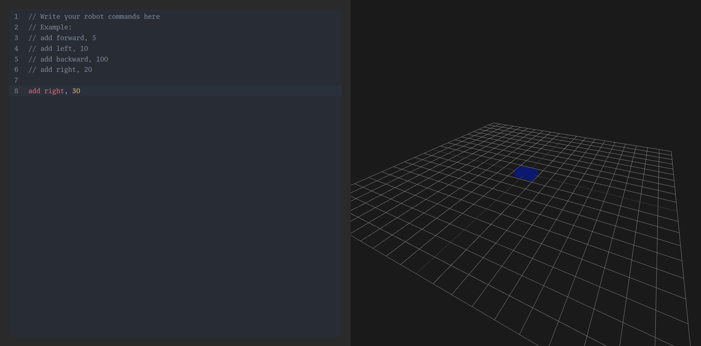
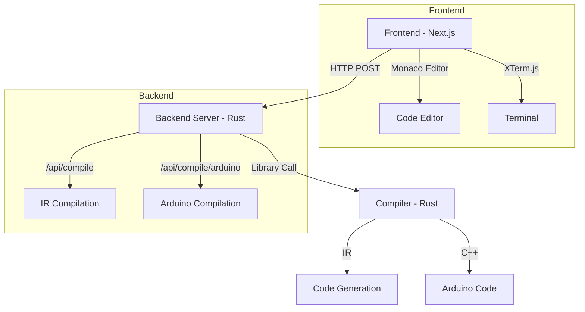

# 🚀 RoboCode IDE - HackDavis 2025

<div align="center">



**A revolutionary web-based IDE with a custom assembly-like language for robotics programming!**

[](https://hackdavis.io)
[](https://nextjs.org)
[](https://www.rust-lang.org)

</div>

## 🌟 Overview

RoboCode IDE is a cutting-edge development environment that combines the power of modern web technologies with a custom-built compiler for robotics programming. Whether you're a robotics enthusiast, student, or professional developer, our platform provides an intuitive interface for writing and executing robot control code.

<<<<<<< Updated upstream
Here is an image of the API being called and getting the compiled code as an output.


### ✨ Key Features
=======
## 📊 Architecture
>>>>>>> Stashed changes



## 🛠️ Tech Stack

### Frontend Powerhouse
- ⚛️ **Next.js 15** - React framework for production
- 📝 **TypeScript** - Type-safe development
- 🎨 **Tailwind CSS** - Utility-first styling
- 📊 **Monaco Editor** - VS Code-like editing experience
- 🖥️ **XTerm.js** - Terminal emulation
- 🎯 **React Icons** - Beautiful iconography

### Robust Backend
- 🦀 **Rust** - Systems programming language
- 🔧 **Custom Compiler** - Purpose-built for robotics
- 🌐 **Unicode Support** - International character compatibility
- 📦 **Module System** - Organized code structure

## 📡 API Documentation

### Compilation Endpoints

#### 1. Compile to IR
```http
POST /api/compile
Content-Type: application/json

{
    "code": "your assembly code here"
}
```

**Response:**
```json
{
    "output": "compiled IR in JSON format"
}
```

**Error Response:**
```json
{
    "error": "error message"
}
```

#### 2. Compile to Arduino
```http
POST /api/compile/arduino
Content-Type: application/json

{
    "code": "your assembly code here"
}
```

**Response:**
```json
{
    "output": "generated Arduino C++ code"
}
```

**Error Response:**
```json
{
    "error": "error message"
}
```

### Assembly Language Syntax

```assembly
# Example program
circle:
    mov direction, 1    # Turn left
    mov forward, 4      # Move forward 4 units
    mov direction, 0    # Go straight

main:
    jal circle          # Jump to circle routine
    mov forward, 4      # Move forward
    jal circle          # Repeat pattern
```

### Available Commands

| Command | Description | Example |
|---------|-------------|---------|
| `mov direction, N` | Set movement direction | `mov direction, 1` |
| `mov forward, N` | Move forward N units | `mov forward, 4` |
| `mov backward, N` | Move backward N units | `mov backward, 2` |
| `mov wait, N` | Wait N seconds | `mov wait, 1` |
| `jal label` | Jump to label | `jal circle` |

## 🚀 Getting Started

### Prerequisites
- Node.js 18+
- Rust and Cargo
- Git

### Quick Start

1. **Clone & Install**
   ```bash
   git clone https://github.com/yourusername/hackdavis-2025.git
   cd hackdavis-2025
   ```

2. **Frontend Setup**
   ```bash
   cd client
   npm install
   npm run dev
   ```

3. **Backend Setup**
   ```bash
   cd server
   cargo run
   ```

4. **Compiler Setup**
   ```bash
   cd compiler
   cargo build
   cargo test
   ```

## 📁 Project Structure

```
hackdavis-2025/
├── client/                  # Frontend application
│   ├── app/                # Next.js app directory
│   │   ├── components/     # React components
│   │   ├── page.tsx       # Main page
│   │   └── globals.css    # Global styles
│   └── package.json       # Frontend dependencies
│
├── server/                 # HTTP backend
│   ├── src/               # Server source
│   │   └── main.rs       # API endpoints
│   └── Cargo.toml        # Server dependencies
│
├── compiler/              # Rust compiler backend
│   ├── src/              # Source code
│   │   ├── lexer.rs     # Token analysis
│   │   ├── parser.rs    # AST generation
│   │   └── lib.rs       # Core functionality
│   └── Cargo.toml       # Rust dependencies
│
└── README.md             # Project documentation
```

## 🤝 Contributing

We welcome contributions! Here's how you can help:

1. Fork the repository
2. Create your feature branch (`git checkout -b feature/AmazingFeature`)
3. Commit your changes (`git commit -m 'Add some AmazingFeature'`)
4. Push to the branch (`git push origin feature/AmazingFeature`)
5. Open a Pull Request

## 📝 License

This project is licensed under the MIT License - see the [LICENSE](LICENSE) file for details.

## 🙏 Acknowledgments

- HackDavis 2025 organizers and mentors
- The amazing Next.js and Rust communities
- All contributors and supporters

---

<div align="center">

**Built with ❤️ at HackDavis 2025**

[Report Bug](https://github.com/yourusername/hackdavis-2025/issues) · [Request Feature](https://github.com/yourusername/hackdavis-2025/issues)

</div>
